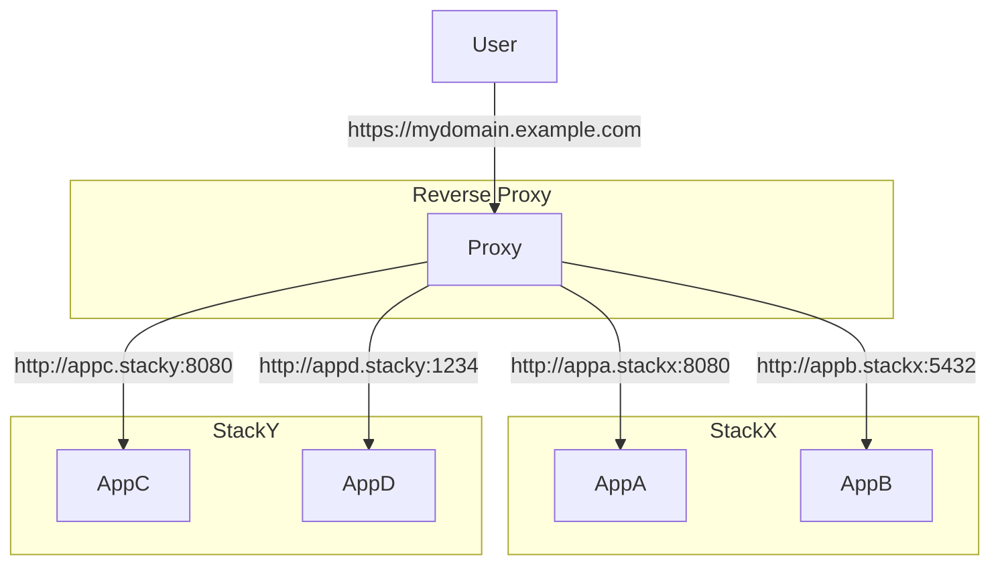

# brightSPARK Labs Reverse Proxy

An `appcli` based project for standing up a reverse proxy to manage traffic for multiple `docker-compose` projects running on the same machine.

## Overview

The idea of this project is to have a central ingress point for all the `docker-compose` / `appcli` projects that are part of your tech stack.

It provides the following benefits:

- Stops nested services fighting over the `80/443` port allocation.
- Central place to manage `TLS` certificates and keys.
- Central point to offload `AuthZ/AuthN` verification.
- Central place to manage `DNS` based routing.

## Configuration

See [appcli](https://github.com/brightsparklabs/appcli) for information on basic `appcli` setup.

The projects can be configured in the `settings.yml` file.
