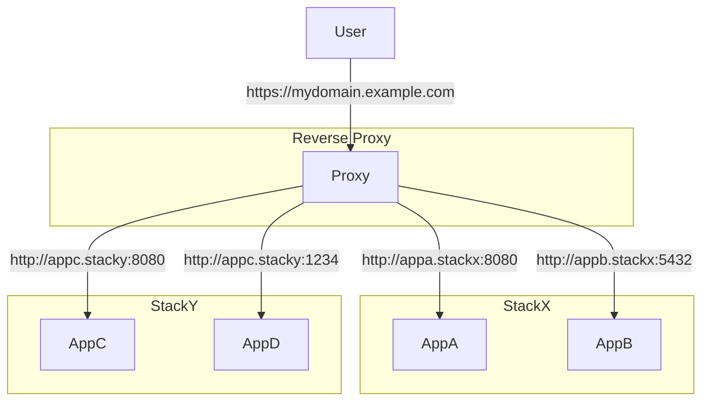

# brightSPARK Labs Reverse Proxy

An `appcli` based project for standing up a reverse proxy to manage traffic for multiple `docker-compose` projects running on the same machine.

## Overview

## Configuration