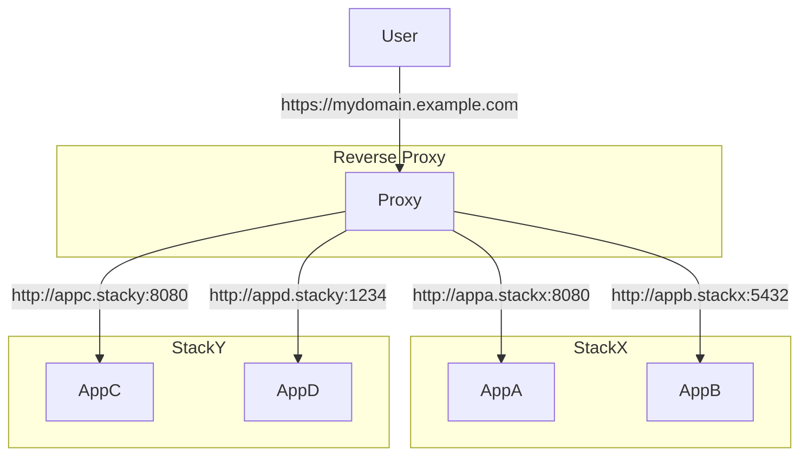

# brightSPARK Labs Reverse Proxy

An `appcli` based project for standing up a reverse proxy to manage traffic for multiple `docker-compose` projects running on the same machine.

## Overview

The idea of this project is to have a central ingress point for all the `docker-compose` / `appcli` projects that are part of your tech stack.



It provides the following benefits:

- Stops nested services fighting over the `80/443` port allocation.
- Central place to manage `TLS` certificates and keys.
- Central point to offload `AuthZ/AuthN` verification.
- Central place to manage `DNS` based routing.

## Configuration

See [appcli](https://github.com/brightsparklabs/appcli) for information on basic `appcli` setup.

The projects can be configured in the `settings.yml` file.

```yaml
reverse_proxy:
  # Settings pertaining to the services.
  services:
    proxy:
      # Whether to use the Acme Staging CA for certificates.
      enable_staging_ca: false

      # Whether to use internal Caddy certificates rather than Acme ones (useful for testing).
      enable_internal_tls: true

  # Settings pertaining to the forwarded networks and routes.
  routing:
    # List of known docker networks to route to. Does not need to include the network for this project.
    # - name: internal-docker-network  <- Internal docker network.
    #   aliases:
    #   - "actual-domain.example.com"  <- Aliases. Same as `docker network create --alias $`
    networks: []

    # List of services to route to.
    # - dns_record: kibana.myproject.local        <- External record.
    #   endpoint: kibana-montitoring-network:5601 <- Internal service.
    routes: []
```

It is assumed that all the `reverse_proxy.routing.networks` networks have already been created.
If they do not exist, then they will need to be created manually.

```bash
docker network create stack-b_default \
  --label "com.docker.compose.network=default" \
  --label "com.docker.compose.project=stack-b" \
  --label "com.docker.compose.version=2.29.7"
```